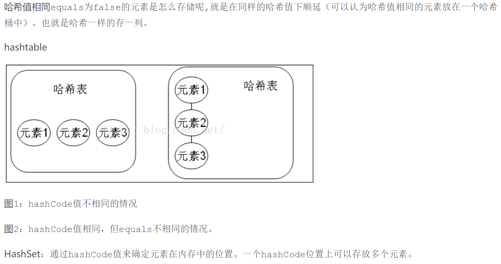
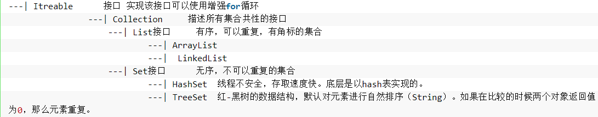
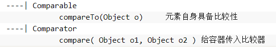
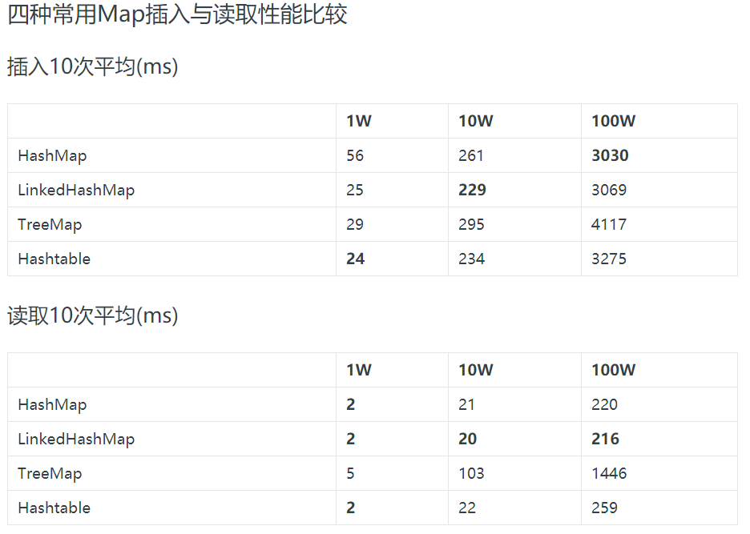
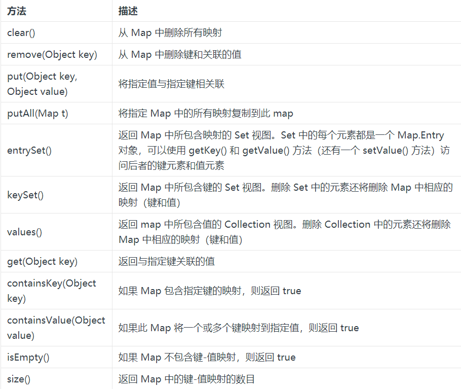
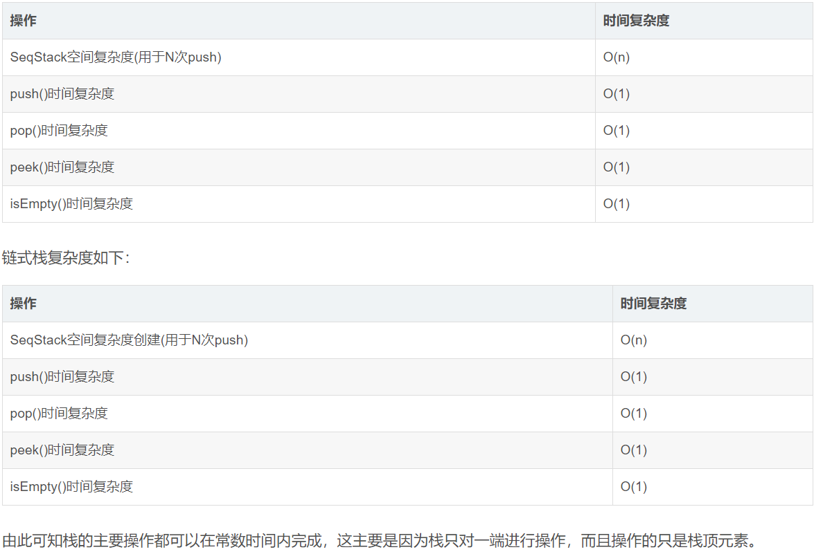
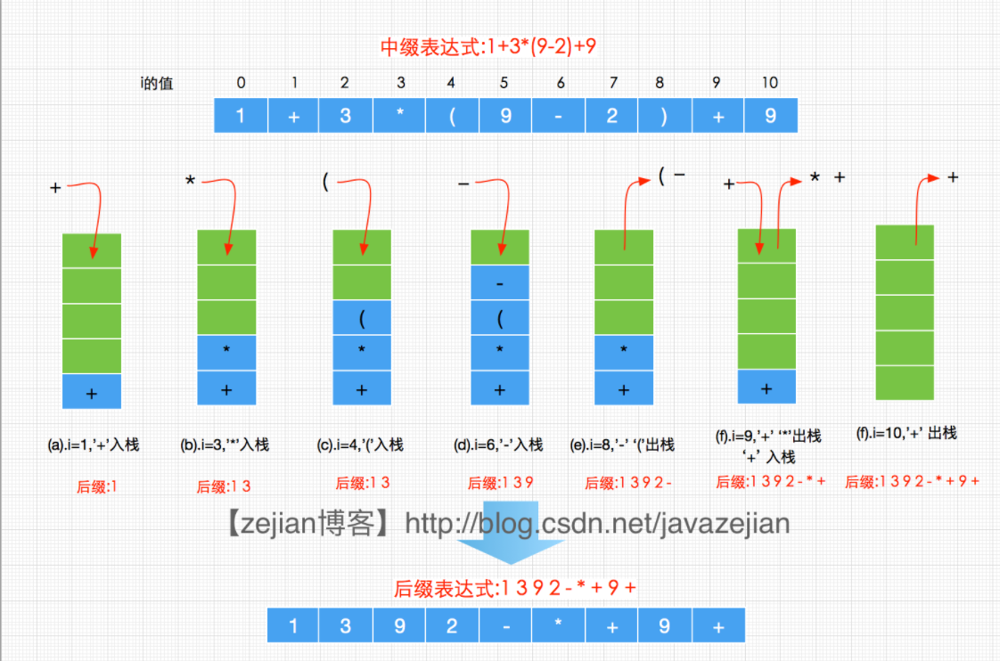
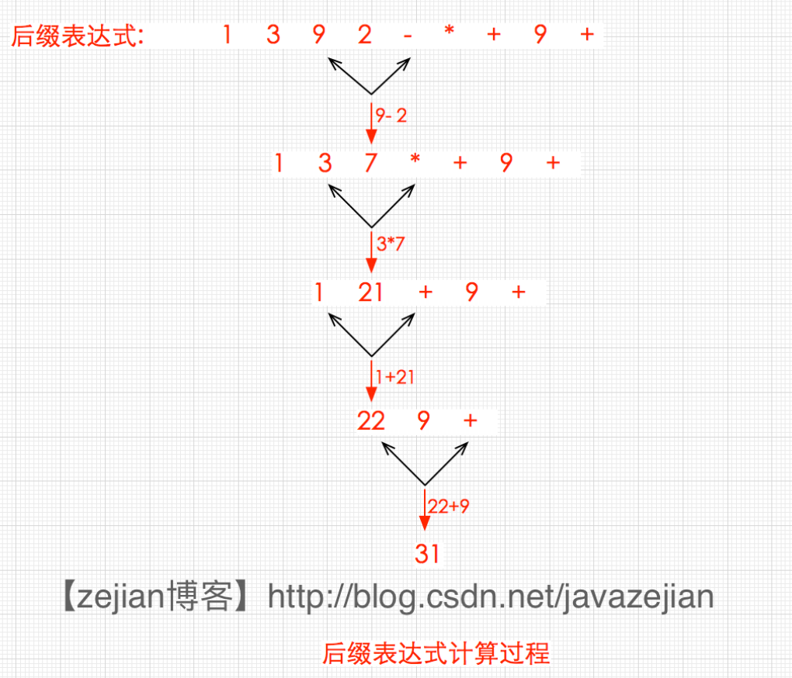

# 数据结构
1. java队列——queue详细解析
        Queue：先进先出(FIFO)的数据结构。与List、Set同一级别，都是继承了Collection接口。
2. LinkedList、ConCurrentLinkedQueue、LinkedBkockingQueue对比分析
3. <a href="https://blog.csdn.net/qq_33642117/article/details/52040345">Set</a>
    - 存储无序不重复的值
    - 对象的相等性
      - 引用到堆上同一对象的两个引用是相等的。如果对两个引用调用hashCode()会得到相同的结果。（默认情况下，Object的hashCode()返回对象的32位jvm内存地址。）因此，如果对象所属的类没有覆盖Object的hashCode()，指向同一对象的引用调用hashCode的值相等，而不同对象的引用的hashCode值是不可能相等的。
      - HashSet不存入重复元素的规则是：hashCode()和equals()。元素的哈希值通过元素的hashCode()方法来获取，hashSet首先会判断两个元素的哈希值，如果哈希值一样，接着会用equals()比较，如果equals()的结果为true，HashSet就将其视为同一个元素，否则反之。
      - HashSet通过hashCode()来确定元素在内存中的位置。一个hashCode位置上可以存放多个元素。
      
      - 当两个引用的equals()不相等时，它们的hashCode()有可能是相等的。然而，对于两个equals()不相等的引用来说，hashCode()也不相同可以提升hash tables的性能。（也就是说，不同对象的hashCode可能相同；假如不同Java对象A和B，A和B不相等（eqauls结果为false），但A和B的哈希码相等，将A和B都存入HashMap时会发生哈希冲突，也就是A和B存放在HashMap内部数组的位置索引相同这时HashMap会在该位置建立一个链接表，将A和B串起来放在该位置，显然，该情况不违反HashMap的使用原则，是允许的。当然，哈希冲突越少越好，尽量采用好的哈希算法以避免哈希冲突。）
      - 所以Java对于hashCode()和equals()是这样规定的：
        - 1.如果两个对象相同，那么它们的hashCode()一定要相同
        - 2.如果两个对象的hashCode()相同，它们不一定相同（这里说的对象相同是指用equals()比较）
        - 3.equals()相等的两个对象，hashCode()一定相同；equals()不想等的两个对象，却并不能证明它们的hashCode()不想等。
    - HashSet和ArrayList集合都有判断元素是否相同的方法，HashSet使用hashCode()和equals()；ArrayList使用equals()。
    - 问题：现有一批数据，要求不能存重复元素，而且要求排序。这种时候就要使用TreeSet了。
          
      - 红黑树是一种典型的二叉树，红黑树算法规则：左小右大。
      - 既然TreeSet可以自然排序，那么TreeSet必定是有排序规则的。
        - 1.元素自身具备比较性。需要实现Comparable接口，重写compareTo()。
        - 2.容器自身具备比较性。定义一个类实现Comparator接口，重写compare方法，并将该接口的子类实例对象作为参数传递给TreeMap集合的构造方法。
        - 注意：当以上两种方式同时存在时，以Comparator比较方式为主。
          
    - LinkedList
        - 会保存插入大的顺序
    - 总结
        - 1.看到array 就要想到 角标
        - 2.看到link 就要想到 first,last
        - 3.看到hash 就要想到 hashCode，equals
        - 4.看到tree 就要想到 Comparable，Comparator
        
> reference1: https://blog.csdn.net/qq_33642117/article/details/52040345  
reference2: http://www.cnblogs.com/qlky/p/7360210.html  
reference3: https://www.cnblogs.com/xudong-bupt/p/3960177.html  
reference4: https://www.cnblogs.com/Qian123/p/5703507.html  
reference5: https://blog.csdn.net/chinayuan/article/details/3345559(读了1/3)

4. <a href="https://blog.csdn.net/zcw4237256/article/details/78266117">List</a>
  - ArrayList
    - 基于数组实现，是一个动态数组，能实现自动扩容。
    - 不是线程安全的，只能在单线程环境下使用。多线程环境下可以考虑使用Collections.synchronizedList(List 1)函数返回一个线程安全的ArrayList类，或者使用concurrent并发包下的CopyOnWriteArrayList类。
    - ArrayList实现了Serializable接口，因此支持序列化，能够实现序列化传输；实现了RandomAccess接口，支持快速随机访问(通过下标访问)；实现了Cloneable接口，能被clone。
    - 每个ArrayList都有一个容量，该容量是指用来存储列表元素的数组的大小。它总是至少等于列表的大小。不断添加元素的过程中，其容量也会自动增长，但是自动增长会导致数组的copy，因此，如果能预知数据量的大小，最好在构造ArrayList时制定其容量。在添加大量元素前，应用程序可以使用ensureCapacity操作来增加ArrayList实例的容量，这样可减少递增式再分配的数量。
      - 注意：此实现不是同步的。如果多个线程同时访问一个Arraylist实例，而其中至少一个线程从结构上修改了列表，那么它必须保持对外同步。
      - 注意扩充容量的方法ensureCapacity。ArrayList在每次增加元素（可能是1个，也可能是一组）时，都要调用该方法来确保足够的容量。当容量不足以容纳当前的元素个数时，就设置新的容量为旧的容量的1.5倍加1，如果设置后的新容量还不够，则直接新容量设置为传入的参数（也就是所需的容量），而后用Arrays.copyof()方法将元素拷贝到新的数组（详见下面的第3点）。从中可以看出，当容量不够时，每次增加元素，都要将原来的元素拷贝到一个新的数组中，非常之耗时，也因此建议在事先能确定元素数量的情况下，才使用ArrayList，否则建议使用LinkedList。
    - 构造方法：注意其三个不同的构造方法。无参构造方法构造的ArrayList的容量默认为10，带有Collection参数的构造方法，将Collection转化为数组赋给ArrayList的实现数组elementData
    - ArrayList基于数组实现，可以通过下标索引直接查找到指定位置的元素，因此查找效率高，但每次插入或删除元素，就要大量地移动元素，插入删除元素的效率低。
    - 在查找给定元素索引值等的方法中，源码都将该元素的值分为null和不为null两种情况处理，ArrayList中允许元素为null
> reference1: https://blog.csdn.net/zcw4237256/article/details/78266117  
reference2: https://blog.csdn.net/wz249863091/article/details/52853360  
  - .clear()
    - .clear会清楚掉list中对象的引用，让这些对象变为垃圾。但是list本身在jvm中的地址不会被清除。
  - .size()返回的是list中元素的个数，和其能容纳的元素个数是两个不同的概念。.clear会empty list，使其size=0，但是list能容纳的元素个数应该是.clear前的个数。

5. <a href="https://baike.xsoftlab.net/view/250.html">Map</a>
  - Map类型
    - 通用Map
      - 用于在应用程序中管理映射，通常在java.util程序包中实现。
      - HashMap、HashTable、Properties、LinkedHashMap、IdentityHashMap、TreeMap、WeakHashMap、ConcurrentHashMap。
    - 专用Map
      - 通常不必亲自创建此类Map，而是通过某些其他类对其进行访问。
      - java.util.jar.Attributes、javax.print.attribute.standard.PrinterStateReasons、java.security.Provider、java.awt.RenderingHints、javax.swing.UIDefaults。
    - 执行实现map
      - 一个用于可以令用户自定义实现自己的Map类的抽象类
      - AbstractMap
  - 常用类型及区别
    - HashMap
      - 最常用。它根据键的hashCode值存储数据，根据键可以直接获取它的值。具有很快的访问速度。HashMap最多只允许一条记录的key为NULL（多条会覆盖），允许多条value为NULL。非同步的。
    - HashTable
      - 与HashMap类似，不同的是：key和value的值均不允许为NULL；它支持线程的同步——即在任一时刻只有一个线程能写HashTablem，因此也导致了HashTable在写入时较慢。
    - TreeMap
      - 能够把它保存的记录根据键(key)排序，默认是按升序排序。也可以指定排序比较器。当用Iterator遍历TreeMap时，得到的记录是排过序的。TreeMap不允许key的值为NULL。非同步的。
    - LinkedHashMap
      - 保存了记录的插入顺序，在用Iterator遍历LinkedHashMap时，先得到的记录肯定是先插入的。遍历速度会比HashMaP慢（因为要寻址）。key和value均允许为空。非同步。
  - 增删改查
    - 插入修改：.put()
    - 删除：.remove()
    - 获取：.get()
    - 清空：.clear()
  - 读取性能比较
  
  - 遍历方式
    - 1.增强for循环遍历
    - 2.迭代器遍历
    - 3.遍历性能比较
      - 增强for循环使用方便，但性能较差。不适合处理大规模数据。
      - 迭代器的遍历速度要比增强for循环块很多，是增强for循环的2倍左右。
      - 使用entrySet遍历的速度要比keySet快很多，是keySet的1.5倍左右。
      > Iterator > foreach  
      entreSet > keySet
  - Map排序
    - 按照key排序
      - HashMap、HashTable、LinkedHashMap排序推荐使用Collections.sort(list, new Comparator())自定义排序器。
      - TreeMap推荐通过new TreeMap(new Comparator())方式。
    - 按照value排序
      - 通用Collections.sort(list, new Comparator())自定义排序器实现。
  - 常用API
  
6.<a href="https://blog.csdn.net/javazejian/article/details/53362993">栈</a>
  - 含义
    - 栈（Stack）有点类似于链表或者顺序表（统称线性表）。栈于线性表最大的区别是数据的存储操作。可以认为栈是一种特殊的线性表，它的的插入和删除操作只允许在线性表的一端进行，一般而言，把允许操作的一端称为栈顶（Top），不可操作的一端称为栈底（Bottom），同时把插入元素的操作称为入栈（Push），删除元素的操作称为出栈（Pop）。如果栈中没有任何元素，称为空栈。
  - 特点
    - 先进后出。栈也被称为后进先出（Last In First Out）/先进后出（First In Last Out，FILO）的线性表。
    - 栈顶永远指向栈内最顶部的元素，因此不能对指定位置元素进行删除。
  - 分类
    - 顺序栈
      - 定义
        - 顾名思义，就是采用顺序表实现的栈，顺序栈的内部以顺序表为基础，实现对元素的存取控制。
      - 主要操作以及设计与实现
        - 创建
        - 增（入栈）：.push()
        - 删（出栈）：.pop()
        - 判空
        - 查（获取栈顶元素）：.peek()
        - 扩容
    - 链式栈
      - 定义
        - 采用链式结构存取的栈。可以使用不带头节点的单链表实现。
      - 链式栈的设计与实现
         - 创建
         - 增（入栈）：.push()
         - 删（出栈）：.pop()
         - 判空
         - 查（获取栈顶元素）：.peek()
         - 扩容
    - 顺序栈和链式栈中各操作算法复杂度对比
    
  - 栈的应用
    - 栈的应用很广泛，如：
      - 符号匹配
        - 在编写程序时，可能经常会遇到圆括号“()”和“{}”，这些符号都必须是左右匹配的，这就是符号匹配类型。当然，符合不仅需要个数相等，而且需要先后左右的依次出现，否则就不符合匹配规则，如“)(”，明显就是错误的匹配，而“（）”才是正确的匹配。有时候符合如括号还会嵌套出现，如“9-(5+(5+1)))”，而嵌套的匹配原则是一个右括号与其前面最近的一个括号匹配事实上编译器帮我们检查错误也是同样的匹配原理，而这一系列操作都需要借助栈来完成。
      - 举例：(str="((5-3)*8-2)")
        - 1. 设置str是一个表达式字符串，从左到右依次对str中的每个字符char进行语法检测，如果char是左括号则入栈，如果char是又括号则出栈（有一对匹配就可以匹配一个左括号，因此可以出栈），若此时出战的char是左括号，说明这一对括号匹配正常。如果这时栈为空或者出栈字符不为左括号，则表示缺少与char匹配的左括号，即目前不完整。
        - 2. 重复执行a操作，知道str检测结束。如果此时栈为空，则全部括号匹配，如果栈中还有左括号，则说明缺少右括号。
      - 中缀表达式转换为后缀表达式
        - 中缀表达式
          - 将运算符写在两个操作数中间的的表达式称作中缀表达式。如：
            ```
            //1+3*(9-2)+9 --->中缀表达式（跟日常见到的表达式没啥区别）
            ```
        - 在中缀表达式中，运算符拥有不同的优先级，同时也可以使用圆括号改变运算的优先顺次序。由于这两点的存在，使得中缀表达式的运算规则比较复杂，求值的过程不能从左往右依次计算，当然这时相对计算机而言。既然这样，那就需要把中缀表达式转换成计算机容易理解且不复杂的表达式，这就是后缀表达式了。在后缀表达式中，运算符是没有优先级的，整个计算都遵循从左往右的次序依次计算。如下：
          ```
          //1+3*(9-2)+9        转化前的中缀表达式
          //1 3 9 2 - * + 9 +  转化后的后缀表达式
          ```
        - 中缀转后缀表达式需要用到栈，这里假设A栈A用于协助转换，并使用数组B用于存放转化后的后缀表达式具体过程如下：
          - 1. 如果遇到操作数，将其直接放入数组B中。
          - 2. 如果遇到运算符，将其放入栈A中；遇到左括号也将其放入A中。
          - 3. 如果遇到一个右括号，则将栈元素弹出，将弹出的运算符输出并存入数组B中直到遇到左括号为止。注意，左括号只弹出并不存入数组。
          - 4. 如果遇到任何其他操作符，如（“+”，“*”，“(”）等，从栈中弹出元素存入数组B中直到遇到发现更低级优先级的元素（或者栈为空为止）。弹出这些元素后，才能将遇到的操作符压入栈中。有一点要注意，只有遇到“)”的情况下，我们才弹出“(”，其他情况不弹出“(”。
          - 5. 如果读到了输入的末尾，则将栈中所有元素依次弹出存入到数组B中。
          - 6. 到此中缀表达式转化为后缀表达式完成，数组存储的元素的顺序就代表转化后的后缀表达式。
          
          
        - 转成后缀表达式后，计算机如何利用后缀表达式进行计算？
          - 通过前面的分析可知，后缀表达式是没有括号的，而且计算过程是从左到右依次进行。因此，在后缀表达式的求值过程中：
            - 1. 当遇到运算符时，只需要提取前两个操作数直接进行计算即可，而当遇到操作数时不能立进行求职计算，此时必须先把操作数保存，等待获取到运算符时在计算；
            - 2. 如果存在多个操作数，其运算次序是后出现的操作数先进行运算。
          - 因此后缀表达式的计算过程也需要借助栈来完成，该栈用于存放操作数。后缀表达式计算过程及图解如下：
          
          - 简单分析说明一下
            - 1. 如果char是数字，先将其转换为整数再入栈
            - 2. 如果是运算符，将两个操作数出栈，计算结果再入栈
            - 3. 重复a)和b)直到后缀表达式结束，最终栈内元素即为计算结果
      - 计算后缀表达式
      - 实现函数的嵌套使用
      - HTML和XML中的标签匹配
      - 网页浏览器中已访问页面的历史记录
  - <a href="https://blog.csdn.net/f2006116/article/details/51375225">Stack实现详解</a>
    
  
  
